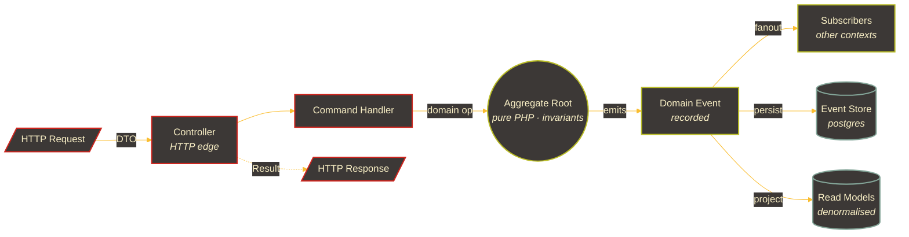

<!-- ── header ─────────────────────────────────────────────────── -->

<p align="center">
  <a href="https://git.io/typing-svg">
         frameworks"/>
  </a>
</p>

<p align="center">
  <a href="mailto:zaevdev@gmail.com"></a>
  <a href="https://t.me/zaevdev"></a>
  <a href="https://vk.com/zzzaev"></a>
</p>

<p align="center">
  
  
  
  
  
</p>

---

<!-- ── intro shell ────────────────────────────────────────────── -->

```bash
zaevdev@github:~$ whoami --short
 alexander zaev · senior backend · moscow · ru

zaevdev@github:~$ stack --core
 php_8.3+   yii2   laravel_10-12   postgres_16+postgis   redis   docker

zaevdev@github:~$ stack --discipline
 ddd   hexagonal   event_sourcing   cqrs   tdd   trunk_based

zaevdev@github:~$ availability --next-30-days
 ▓▓▓▓▓▓▓▓▓▓▓▓▓▓▓▓░░░░░░░░░  open to senior · ru remote / moscow

zaevdev@github:~$ cat /etc/motd
 «архитектурные решения важнее выбора фреймворка»
```

---

### `~$ cat tldr.txt`

> **Senior backend, 5+ лет на PHP** (включая собственные продукты).
> Проектирую и довожу до продакшна domain-driven системы — от Yii1(2)-монолитов
> до Laravel-микросервисов на Octane. Беру роль, где архитектура — это
> **ответственность**, а не косметика поверх Eloquent.

---

### `~$ ./highlights --top 5`

```
[01]  Ikhtion           PWA с 11 DDD-доменами, 78 domain events, 1264+ тестами
                        собственный event store на postgres · YOLOv8 → BEiTv2 cascade
[02]  Dovezlo           агрегатор тарифов 8 служб доставки · DDD + hexagonal
                        18 DDD-доменов · telegram bot+webapp · web push · billing
[03]  legacy → modern   миграции Yii2 → Laravel через strangler fig, без big-bang
[04]  high-load         octane (swoole) · async projections · read models · postgis
[05]  payments          T-Bank · Сбербанк · ЮKassa · СБП-QR · Robokassa · ФНС
```

---

### `~$ cat principles.md`

```diff
+ [01]  domain        >  framework
+ [02]  tests         <  code             // pre-, not post-
+ [03]  bounded_ctx  :=  responsibility, not folder
+ [04]  cross_ctx    :=  events only, no shared models
+ [05]  event_src    :=  where audit matters, not everywhere
+ [06]  pest_arch     >  human review                  (in CI, always)
+ [07]  phpstan_lvl9 :=  starting line, not a goal
+ [08]  legacy        →  strangler_fig, never full rewrite

! не «лучшие практики из статей», а позиции, за которые я готов спорить на ревью.
```

---

### `~$ ps aux | grep now`

```diff
@ ikhtion · github.com/zaevdev/ikhtion              status: prod
+   live · https://ikhtion.ru
+   PWA для рыбаков · 11 DDD-доменов · 78 domain events · 1264+ tests · 90+ API
+   AI-каскад: YOLOv8 → FPN → BEiTv2 (собственный fastapi-сервис)
+   собственный event store на postgres · personal data encryption (152-FZ)
+   real-time WebSocket (reverb) · postgis · blue-green deployment
+   stack: laravel_12 (octane) · next_15 · react_19 · fastapi · docker

@ dovezlo · github.com/zaevdev/dovezlo              status: portfolio
+   агрегатор тарифов 8 служб доставки:
+   СДЭК · Почта России · ПЭК · Деловые Линии
+   Яндекс.Доставка · DPD · Dostavista · Пешкарики
+   DDD + hexagonal · 18 DDD-доменов · phpstan_lvl_9
+   Telegram bot + WebApp (nutgram) · Robokassa · web push · подписки · промокоды
+   stack: php_8.3 · laravel_12 · vue_3 · postgres_16 · redis_7 · horizon · openapi
```

→ live: [ikhtion.ru](https://ikhtion.ru)

---

### `~$ history --commercial`

```diff
@ FixPrice · smart retail tech · крупный российский ритейл (FMCG)        dec 2024 → present
+   микросервисный ландшафт на Yii2 / Slim 4 — 7 сервисов:
+
+   ключевые направления:
+     · CRM         основной фокус
+     · delivery    обработка статусов курьерских служб · события Call Center
+     · feedback    DDD + hexagonal рефакторинг · интеграция в Karabus event-bus
+     · payment     платежи Сбербанк (preauth · deposit · refund · reverse · webhook verify)
+
+   унификация ФИАС / КЛАДР по всему проекту
+   асинхронная архитектура: N+ rabbitmq consumers · karabus event-bus · daemon pattern
+   внешние интеграции: 1С · SAP · Mindbox · АТОЛ · Telegram Bot
+   quality gates: phpstan · psalm · phpmd · rector · codeception
+   менторство · code review · повышение архитектурного качества
+   stack: yii2 · slim_4 · php_8.3 · postgres · redis · rabbitmq · elasticsearch · k8s · rancher · gitlab_ci · zabbix

@ peshkariki.ru · городская доставка курьерами        jun 2022 → dec 2024
+   декомпозиция yii-монолита в микросервисы (strangler fig)
+   платежи: T-Bank · Сбербанк · ЮKassa · СБП-QR
+   интеграции: ФНС · OSRM · OpenStreetMap · DaData · Firebase · Mango · Zvonok
+   push-микросервис на firebase admin sdk
+   server-sent events для real-time backend updates
+   stack: yii2 · php · postgres · mysql · redis · rabbitmq · docker
```

> Pet-проекты выше показывают, как я проектирую с нуля.
> Этот блок — про то, как я живу с production: legacy, миграции, нагрузка, команда.

---

<details>
<summary><code>~$ tree projects/ikhtion --depth 2</code></summary>

```
ikhtion/
├── src/Domain/
│   ├── Auth/             jwt + refresh · 152-FZ · consent · legal config
│   ├── Spot/             postgis · ST_DWithin · restricted_zones
│   ├── Catch/            event-sourced aggregate · snapshots
│   ├── Gamification/     event-sourced player profile · leaderboards · projections
│   ├── Community/        websocket real-time feed (reverb) · advisory locks
│   ├── AI/               yolov8 → fpn → beitv2 cascade (fastapi)
│   ├── Payments/         robokassa · ip allowlist · signature verify · subscriptions
│   ├── Notifications/    pluggable transports · web push · email · in-app
│   ├── Profile/          публичный профиль · аватары
│   └── Support/          обратная связь · модерация
├── tests/
│   ├── Unit/             ~70%
│   ├── Feature/          ~25%
│   ├── Architecture/     pest arch · 100% boundaries
│   └── E2E/              playwright (next.js + api)
└── infra/
    ├── docker/           octane (swoole) · postgres+postgis · redis
    └── github/           actions · phpstan · pest · arch tests
```

```
domain:     11 контекстов · 132 value objects · 78 domain events
tests:      1264+    (unit ~70 / feature ~25 / arch+e2e ~5)
api:        90+ REST endpoints · websocket (reverb) · webhooks
infra:      blue-green deploy · personal data encryption (152-FZ) · advisory locks
quality:    PHPStan level 9 · Pest Arch (100% boundaries) · trunk-based
```

</details>

<details>
<summary><code>~$ tree projects/dovezlo --depth 2</code></summary>

```
dovezlo/
├── app/
│   ├── Domain/             18 контекстов · бизнес-логика · контракты
│   │   ├── Calculation/    расчёт стоимости и сроков · валидация · кеш
│   │   ├── Delivery/       8 carrier-провайдеров · нормализация ответов
│   │   ├── Payment/        robokassa · receipts · webhooks
│   │   ├── Subscription/   тарифы · биллинг · промокоды
│   │   ├── Telegram/       bot · webapp · deeplink
│   │   ├── PriceAlert/     отслеживание изменения тарифов
│   │   ├── Notification/   email · web push · in-app
│   │   └── …               Location · Content · BlogPost · Statistics · Updates
│   ├── Application/        use cases · handlers · DTO
│   ├── Infrastructure/     adapters · API-клиенты · persistence
│   └── Http/               controllers · requests · API resources
├── tests/                  codeception (unit + api · ~185 тестов)
└── docs/                   openapi / swagger
```

```
api:      ~163 endpoints · REST v1
quality:  PHPStan level 9 · Larastan · Cognitive Complexity · Pint
ci:       github actions  (pint + phpstan + codeception)
stack:    php_8.3 · laravel_12 · vue_3 · vite_7 · tailwind_4 · postgres_16 · redis_7
```

</details>

---

### `~$ ./request-flow --visualize`



> Один порт со стороны HTTP. Один со стороны БД. Между ними — чистый домен,
> который не знает ни про Laravel, ни про PostgreSQL. Тестируется без обоих.

---

### `~$ stack --tree`

```
backend/
├── runtime           php_7.3-8.5 · octane (swoole) · roadrunner
├── frameworks        laravel_10-12 · yii2 · yii1 (legacy)
├── data              postgresql_16+ · postgis · mysql · redis · rabbitmq
├── patterns          ddd · hexagonal · event_sourcing · cqrs · tdd
└── ml_glue           python · fastapi · pytorch

quality/
├── analysis          phpstan_level_9 · psalm · phpcs · phpmd · rector
├── testing           pest · phpunit · codeception · pest_arch
├── e2e               playwright
└── ci                conventional_commits · trunk_based · gh_actions

frontend/             // when needed, not the main hat (only with AI tools)
├── frameworks        vue_3 · next_15 · react_19
├── language          typescript
└── ui                tailwind

infra/
├── containers        docker · docker_compose
├── proxy             nginx
├── ci_cd             github_actions
└── cloud             yandex_cloud
```

<p>
  
  
  
  
  
  
  
  
  
  
  
  
  
  
  
  
  
</p>

---

### `~$ ./language-mix --self-reported`

```
PHP          ████████████████████░░░░░   78 %  ▎ everyday driver
TypeScript   ████░░░░░░░░░░░░░░░░░░░░░   12 %  ▎ next/vue interfaces
Python       ██░░░░░░░░░░░░░░░░░░░░░░░    5 %  ▎ ml services (fastapi)
SQL          █░░░░░░░░░░░░░░░░░░░░░░░░    3 %  ▎ постоянно, везде
Other        ░░░░░░░░░░░░░░░░░░░░░░░░░    2 %  ▎ shell · yaml · etc.
```

---

### `~$ cat workflow.md`

```diff
@ как я веду проект
+ моделирую домен до того, как открыть IDE
+ пишу красный тест первым — он диктует API
+ ставлю границы контекстов до первого SELECT'а
+ настраиваю pest arch и phpstan_lvl_9 в первый день проекта
+ деплою маленькими PR'ами через trunk · conventional commits

@ от чего отказываюсь
- active record как ядро домена
- shared kernel между контекстами «чтобы быстрее»
- «временные» any/mixed, которые остаются на годы
- code review без архитектурных тестов в CI
- big-bang переписывания
```

---

### `~$ ./ai-toolbelt --status`

```diff
@ как я работаю с ИИ
+ ИИ — соавтор, не автопилот. финальное решение и ревью — за мной.
+ домен и контракты пишу руками; ИИ помогает на скаффолде, тестах, refactor'ах.
+ всё, что попадает в main, проходит phpstan_lvl_9 и pest arch — без исключений.
- никаких vibe-коммитов «сгенерилось — заработало — мержим».
```

```
TOOL              ROLE                                 USAGE
─────────────────────────────────────────────────────────────────────────────
claude_code       agentic refactor · large diffs       ███████████████░░░░  daily
                  миграции legacy · автотесты к доменным агрегатам

codex (cli)       inline edits · быстрые правки        ████████░░░░░░░░░░░  weekly
                  pair-programming в терминале · pre-commit fixups

chatgpt           rubber-duck · архитектурные споры    ██████████░░░░░░░░░  daily
                  «развернуть аргументацию против моего же дизайна»

gemini            long-context reads · whole-repo Q&A  █████░░░░░░░░░░░░░░  weekly
                  быстрый обзор чужих кодовых баз перед code review
```

<p>
  
  
  
  
</p>

> Принципы: ИИ ускоряет рутину, не подменяет проектирование. Любой
> сгенерированный код проходит те же fitness-функции, что и ручной.

---

### `~$ cat learning.md`

```diff
@ foundations · к этим книгам возвращаюсь снова и снова
+ ddd                 Eric Evans · Vaughn Vernon         blue book + red book
+ event_sourcing      Greg Young                         ES · CQRS на проде
+ clean_architecture  Robert Martin                      ports & adapters
+ tdd · xp            Kent Beck                          red-green-refactor as design
+ messaging           Vaughn Vernon                      reactive messaging patterns

@ in_progress · сейчас в работе
+ distributed         saga · process managers · choreography vs orchestration
+ consistency         eventual · idempotency · CRDTs (community / realtime)

@ loop · цикл обучения
+ первоисточник   →   собственный продукт   →   ретро   →   переписать мнение
```

> Высшее техническое + непрерывная практика на собственных продуктах.
> Развёрнутое CV — по запросу.

---

### `~$ ./open-to.sh`

```diff
+ senior backend (php)        продуктовые команды · ddd · сложные домены
+ senior backend (remote)     ru remote · долгосрочные роли
+ senior backend (legacy)     yii2 → laravel · strangler fig · ddd-рефакторинг
+ senior backend (payments)   платежи · внешние API · sse / websocket / push

- галеры и body-shop'ы
- «срочно вчера, без архитектуры»
- «тесты допишем потом»
- проекты, где «архитектура — это папки»
```

---

### `~$ ./contact.sh`

```bash
mail   zaevdev@gmail.com
tg     t.me/zaevdev          # ← best route · напишите коротко: задача + контекст
vk     vk.com/zzzaev
gh     github.com/zaevdev
```

<p align="left">
  <a href="https://git.io/typing-svg">
      
  </a>
</p>
